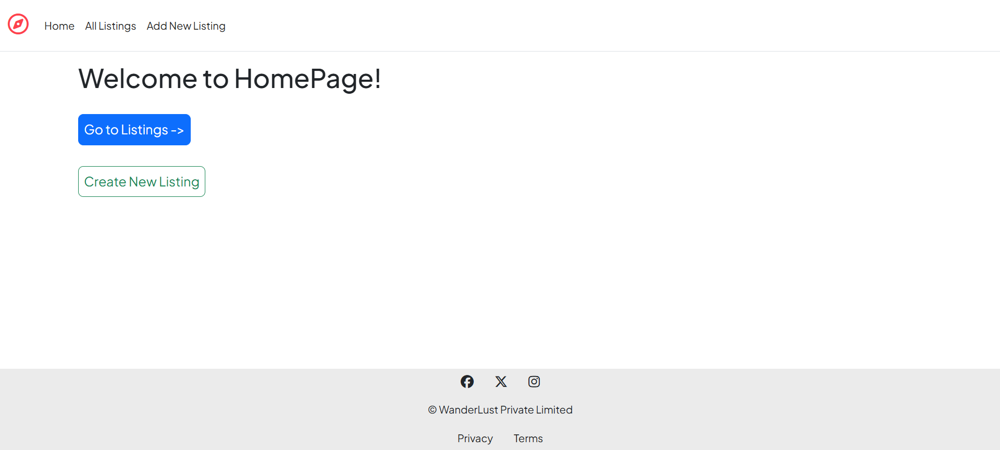
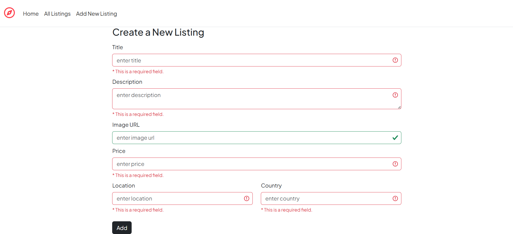

## 🌐 Live Demo

[Visit the Live Site](https://wanderlust-4zod.onrender.com/)

---

# 🌍 WanderLust

A full-stack web application for listing, viewing, editing, and deleting travel accommodations — inspired by platforms like Airbnb. Built with **Node.js**, **Express**, **MongoDB**, **EJS**, and **Bootstrap**.

---

## 🚀 Features

- 🏘️ Create, read, update, delete (CRUD) listings
- 🖼️ Image support with default image fallback
- 💵 Price formatting using Indian locale
- ✍️ Server-side form validation with Joi
- 🛠️ Custom error handling using middleware
- 🎨 Responsive UI with Bootstrap 5

---

## 🧱 Tech Stack

- **Backend**: Node.js, Express
- **Frontend**: EJS, Bootstrap 5, Font Awesome
- **Database**: MongoDB, Mongoose ODM
- **Validation**: Joi
- **Templating**: ejs-mate layout engine

---

## ⚙️ Installation

1. **Clone the repo**

   ```bash
   git clone https://github.com/chauhan22adarsh/WanderLust.git
   cd WanderLust

   ```

2. **Install dependencies**

   ```bash
   npm install

   ```

3. **Start MongoDB locally**

   Make sure MongoDB is running on mongodb://127.0.0.1:27017/wanderlust

4. **📄 Create .env file**

   ```bash
   touch .env

   ```

5. **🛠️ Add the following to your .env file:**

   MONGO_URL=mongodb://127.0.0.1:27017/wanderlust
   port=3000

6. **Run the app**

   ```bash
   node app.js

   ```

7. **Visit**

   Open http://localhost:3000 in your browser

---

## 📂 Directory Structure

```
wanderlust/
├── init/                    # Initial data setup scripts
│   ├── data.js
│   └── index.js
├── models/listing.js       # Mongoose schemas (e.g. listing.js)
├── public/                 # Static files
│   ├── css/style.css
│   └── js/script.js
├── utils/                  # Custom error + async handlers
│   ├── ExpressError.js
│   └── wrapAsync.js
├── views/                  # EJS templates
│   ├── includes/           # Navbar & Footer
│   ├── layouts/            # Boilerplate template
│   └── listings/           # Main views (new, show, edit, etc.)
├── app.js                  # Main Express application
├── schema.js               # Joi validation schema
├── package.json
├── package-lock.json
└── README.md
```

---

## ⚠️ Error Handling

- Validation handled using **Joi**.
- Asynchronous errors handled using a custom wrapAsync() function.
- Custom ExpressError class for clean error messaging.
- Centralized error middleware.

---

## 📸 Screenshots

### Home Page



### All Listings Page


### All Listings Page (iPad Pro)


### Add New Listing Page



### See Listing (iPhone 14 Pro Max)


---

## 🙏 Credits

Made with 💙 by **Adarsh Chauhan**
